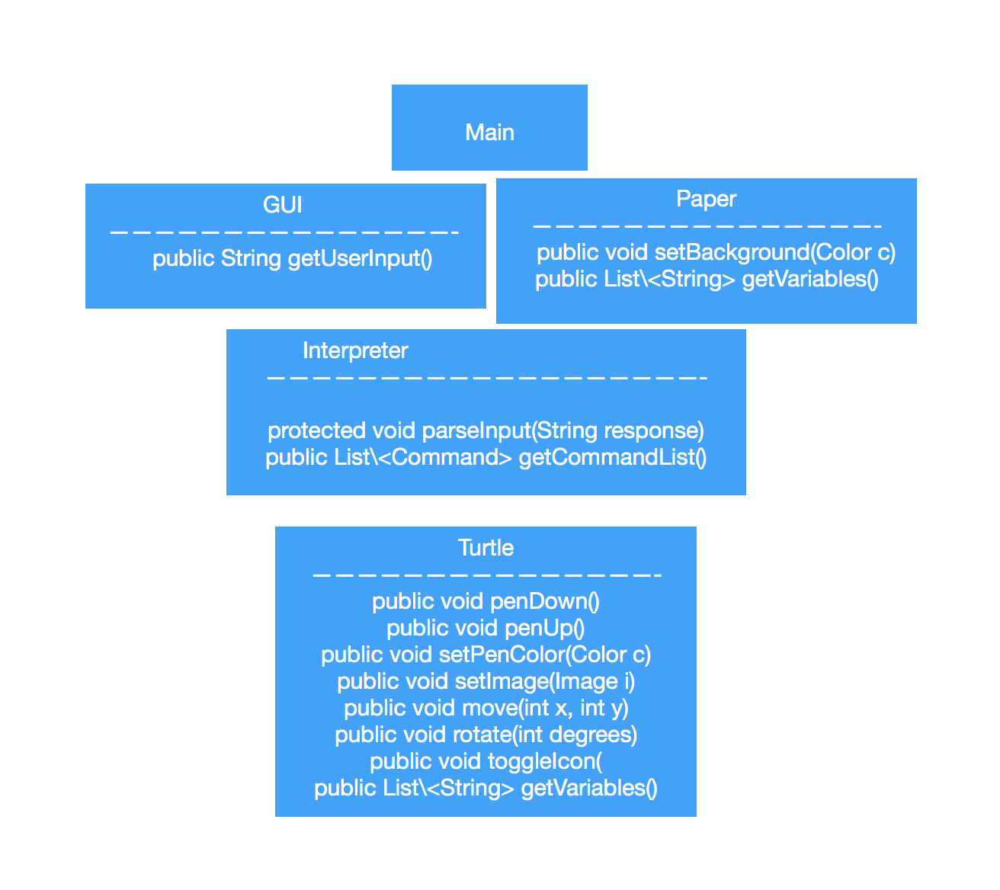
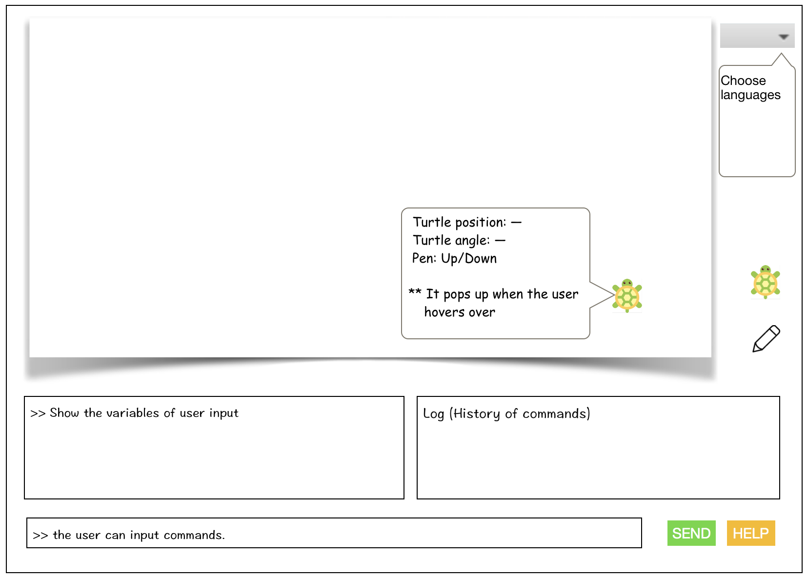
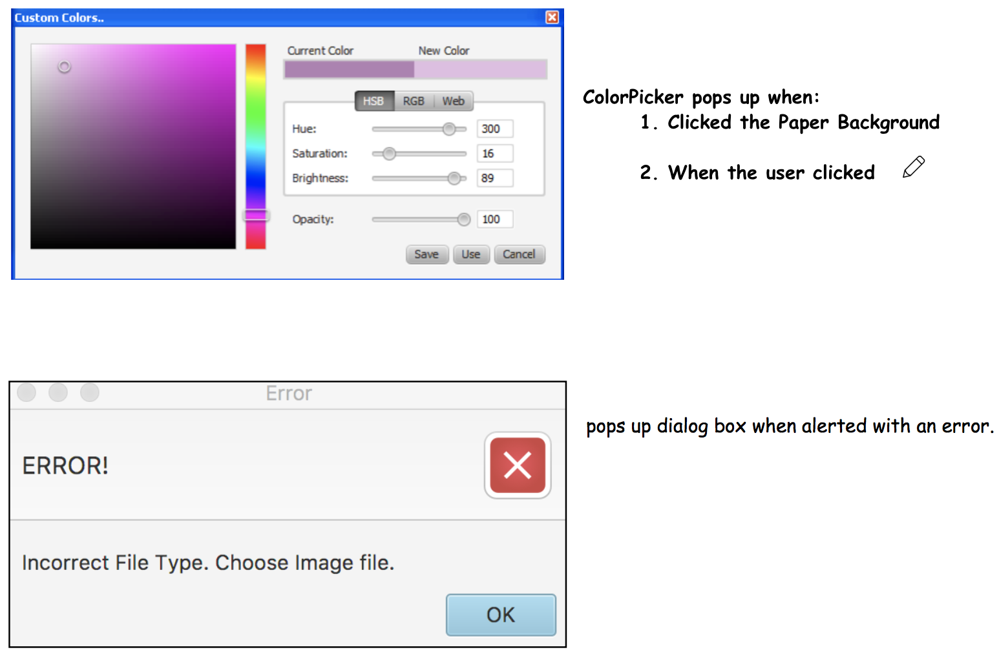

Slogo Team 01 Design Plan
========================


### Introduction
The goal of this program is to  create an IDE that allows users to write programs in a simplified version of the Logo language, called "Simple Logo" or SLogo.

**Primary design goals**: 
We hope to write code that will allow SLogo users to command the dynamicTurtle interactively on a per expression basis. The program should be highly extensible in case of extra demands.

**Primary architecture**:
Our classes will be separated based on front-end and back-end logic.  Classes will be closed with the exception of a couple classes that provide an interface between the front and back end.  These classes will be open, since the information they contain will need to be passed around frequently.


### Design Overview



Our program will contain a Paper class that represents the current state of the paper.  This class should be open, since it will store information required by the front and back-end.  It will maintain a Set of view.dynamicTurtle objects in case we decide to support additional turtles in our program.

A singular view.dynamicTurtle object will move and rotate based on Commands it receives, and its states will be reflected on the Paper. The view.dynamicTurtle can maintain a Set of commands representing its history.

A Command object will contain the changes the dynamicTurtle will have to make to its position and orientation when received.

A view class will be responsible for rendering information from Paper to the user and receiving user input.

A Command view.Interpreter class will receive the String from the user input and wrap each command into Command objects, which are added to a List and passed to the view.dynamicTurtle object. This class will handle syntax errors that may arise.

### User Interface





* The user interface will contain a display of the Paper class, which contains the position of the dynamicTurtle and the pen markings of its path.
* There will be a text box in which the user can input commands. The user can send commands by pressing a **send** button or by pressing enter.
* The user will receive a pop up dialog box when alerted with an error
* There will be a customization portion of the UI where the user can choose colors for the pen and the background. The user can click buttons Change Pen Color or Change BackGround Color and the UI will prompt the user will a ColorPicker.
    * The user can also change the image of the dynamicTurtle/ the color of pen / color of background by clicking view.dynamicTurtle icon / clicking pen Icon / clikcing the background.
* There will be a vertical list below to the Paper display that shows a chronological list of all the commands that the view.dynamicTurtle behaved on
* If the user hovers over a dynamicTurtle, a box of information about the variables of the dynamicTurtle will pop up (dynamicTurtle position, dynamicTurtle angle, pen up/down)
* A Help button can display the different kinds of commands currently available, including user defined commands.
* A Choose Language drop down menu will allow users to change the language the UI is set to

**Cases for Error Pop-up**
* Empty data - empty line of code.
* Syntax Error
* Invalid location of view.dynamicTurtle - out bound of grid
* Invalid file type for image of view.dynamicTurtle - Not .jpeg         or .png
* Non Input data - no img file for view.dynamicTurtle OR did not       choose color for pen


### API Details

We will have four APIs, with the purpose of each defined above in the Design Overview 

* view
    * public String getUserInput()
* view.Interpreter
    * protected void parseInput(String response)
    * public List\<Command> getCommandList()
* view.dynamicTurtle
    * public void penDown()
    * public void penUp()
    * public void setPenColor(Color c)
    * public void setImage(Image i)
    * public void move(int x, int y)
    * public void rotate(int degrees)
    * public void toggleIcon()
    * public List\<String> getVariables()
* Paper
    * public void setBackground(Color c) 
    * public List\<String> getVariables()

### API Example Code
**Action**: User types in a 'fd 50'. 

Within the view.Interpreter class:
```java 
String response = view.getUserInput();
parseInput(response); 
List<Command> cmds = getCommandList(); 
for (Command c : cmds) {
    if (c.equals("Move")) dynamicTurtle.move(c.getArg());
    if (c.equals("Rotate")) dynamicTurtle.rotate(c.getArg());
    ...
    cmdHistory.add(c); // List of previous commands
}
```

**Action**: User selects a pen color.
```java 
penIcon.setOnMousePressed(e -> 
    penIcon.setPenColor(view.pickedColor())
)};
```
**Action**: User selects a paper background.
```java 
Paper.setOnMousePressed(e -> {
    Paper.setBackground(view.pickedColor())
});

```

**Action**: User selects a new icon for the dynamicTurtle.
Within the view class:
```java  
circleIcon.setOnPressed(e -> dynamicTurtle.setImage("/res/Circle"));
```

**Action**: User submits their command.
Within the view class:
```java 
Button submitResponse = new Button(); 
submitResponse.setOnPressed(e -> view.getUserInput());
```

**Action**: User clicks button in view to see environment variables and their current values
Within view class:
``` java
Button submitResponse = new Button(); 
submitResponse.setOnPressed(e -> {
    String env = ""; 
    for (String v : dynamicTurtle.getVariables()){
        env = env + v; 
    }
    for (String v : paper.getVariables()){
        env = env + v; 
    }    
    Alert variables = new Alert(env); // all the env variables
    variables.showAndWait(); 
});
```

**Action**: User clicks view.dynamicTurtle to change icon state
Within view class:
``` java
view.dynamicTurtle dynamicTurtle = new view.dynamicTurtle();
dynamicTurtle.setOnPressed(e -> {
    dynamicTurtle.toggleIcon();
    //Icons will be an enum in view.dynamicTurtle representing possible image values
    //Icons.values() <-- toggleIcon will set dynamicTurtle image to next value in array
})
```

**Action**: User types with syntax error
Within the view.Interpreter class:
``` java
String response = view.getUserInput();
parseInput(response); 
    //parseInput can try/catch the Exception.
}
```

### Design Considerations
* Whether to include a Behavior class
    * __Pros__: encapsulates dynamicTurtle behavior for each command
    * __Cons__: unnecessary layer of abstraction.  Paper can handle all this functionality
    * We ultimately decided that this class is not necessary
* Storing commands in a Command object
    * __Pros__: store all data related to a particular command in a single object
    * __Cons__: could get confusing, requires a Command view.Interpreter to actually parse command line input
    * We ultimately decided to use both a Command and a CommandInterpreter class
* Having a Paper class
    * __Pros__: Has a means for keeping track of the state of the view.dynamicTurtle. It also makes changing the background color encapsulated, instead of just leaving it to the view.
    * __Cons__: Keeps the drawing (rendering of the lines) in a separate class from the view.dynamicTurtle. The view.dynamicTurtle's movements and actions are thus not paired, which may not be necessary to separate.
    * We ultimately decided to use a Paper class.

### Team Responsibilities
* __Natalie__: Back-end (Focus on dynamicTurtle movement)
* __Peter__: Back-end (Focus on command interpretation)
* __Amy__: Front-end (Focus on simulation of Tutle and   user UI preferences; colors, image etc)
* __Seung-Woo__: Front-end (Focus on command line and listing previous commands portion of the view and displaying Paper)